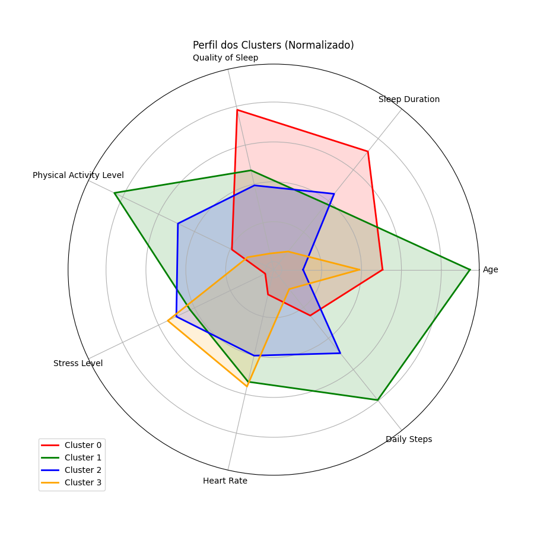
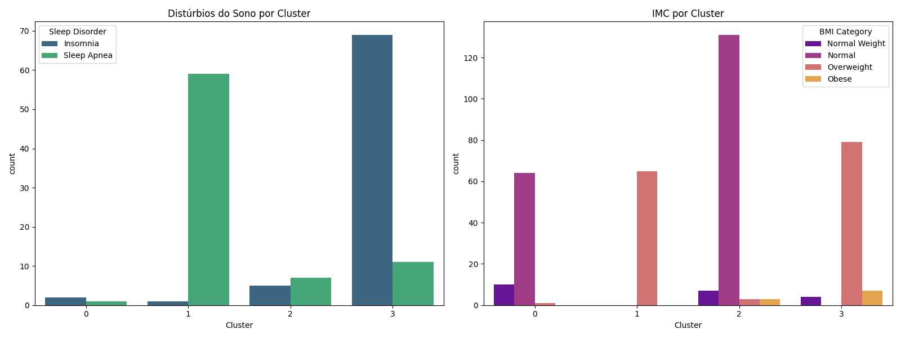
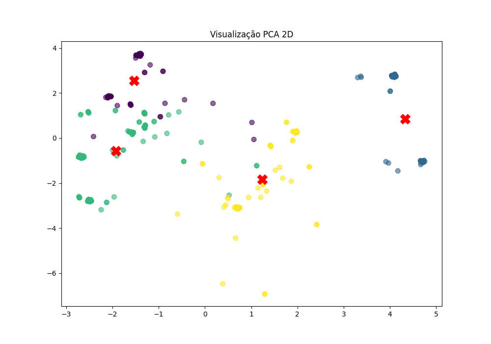

# Relatório de Análise de Clusters: Sono e Estilo de Vida

Este relatório apresenta os resultados da segmentação de perfis utilizando o algoritmo K-Means.

## 1. Resumo dos Grupos (Clusters)

O algoritmo identificou **4 perfis distintos** na base de dados.

### Quantidade de Pessoas por Cluster
|   Cluster |   count |
|----------:|--------:|
|         0 |      75 |
|         1 |      65 |
|         2 |     144 |
|         3 |      90 |

### Médias das Variáveis por Cluster
A tabela abaixo mostra o comportamento médio de cada grupo:
|   Cluster |   Age |   Sleep Duration |   Quality of Sleep |   Physical Activity Level |   Stress Level |   Heart Rate |   Daily Steps |
|----------:|------:|-----------------:|-------------------:|--------------------------:|---------------:|-------------:|--------------:|
|         0 | 44.47 |             7.76 |               8.45 |                     48.33 |           3.64 |        66.93 |       6225.33 |
|         1 | 53.95 |             7.1  |               7.52 |                     82.38 |           5.49 |        71.57 |       8415.38 |
|         2 | 35.83 |             7.22 |               7.29 |                     63.97 |           5.83 |        70.18 |       7201.39 |
|         3 | 41.94 |             6.49 |               6.24 |                     43.76 |           6.04 |        71.82 |       5540    |

---

## 2. Visualização dos Perfis

### Comparativo Geral (Radar Chart)
O gráfico abaixo permite visualizar as forças e fraquezas de cada perfil (dados normalizados).

### Distribuição de Categorias (Distúrbios e IMC)
Como os distúrbios do sono e o peso se comportam em cada grupo?

### Separação dos Grupos (PCA)
Visualização em 2D da separação matemática dos grupos.

---

## 3. Metodologia
- **Algoritmo:** K-Means Clustering
- **K Ideal:** 4 (definido pelo Método do Cotovelo)
- **Pré-processamento:** Padronização Z-Score e One-Hot Encoding para variáveis categóricas.

*Relatório gerado automaticamente.*
